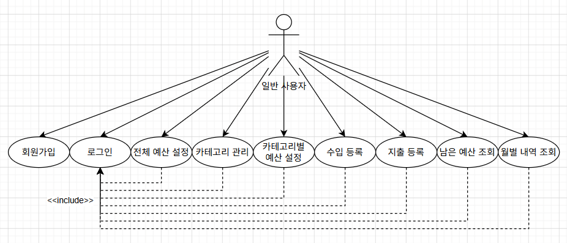

| 항목        | 내용                  |
| ----------- | --------------------- |
| 문서명      | Use Case (유스케이스) |
| 버전        | v1.0                  |
| 작성일      | 2026-07-15            |
| 최종 수정일 | 2026-07-15            |

# 유스케이스 (사용자 시나리오)

## 1. 문서 목적

본 문서는 요구사항 명세를 바탕으로 사용자와 시스템 간의 상호작용을 유스케이스 형태로 구체화하기 위해 작성하였다. 정의된 유스케이스는 시스템 설계, 구현 및 테스트 과정에서 기능의 흐름을 이해하고 검증하기 위한 기준으로 활용한다. 또한 프로젝트 진행 중 기능별 동작 시나리오를 일관되게 관리하기 위한 기준 문서로 활용한다.

## 2. 액터(Actor)

| 액터              | 설명                                                                                                          |
| ----------------- | ------------------------------------------------------------------------------------------------------------- |
| 일반 사용자(User) | 회원가입, 로그인, 예산 관리, 카테고리 관리, 수입/지출 관리, 월별 조회 등 시스템의 모든 기능을 사용하는 사용자 |

## 3. 유스케이스 다이어그램 (Use Case Diagram)

## 4. 유스케이스 목록 (Use Case List)

| ID    | 유스케이스           | 액터        | 관련 요구사항 |
| ----- | -------------------- | ----------- | ------------- |
| UC-01 | 회원가입             | 일반 사용자 | FR-01         |
| UC-02 | 로그인               | 일반 사용자 | FR-02         |
| UC-03 | 전체 예산 설정       | 일반 사용자 | FR-03         |
| UC-04 | 카테고리 관리        | 일반 사용자 | FR-04         |
| UC-05 | 카테고리별 예산 설정 | 일반 사용자 | FR-05         |
| UC-06 | 수입 등록            | 일반 사용자 | FR-06         |
| UC-07 | 지출 등록            | 일반 사용자 | FR-07         |
| UC-08 | 남은 예산 조회       | 일반 사용자 | FR-08         |
| UC-09 | 월별 내역 조회       | 일반 사용자 | FR-09         |

## 5. 유스케이스 명세 (Use Case Specification)

### UC-01 회원가입

| 항목          | 내용                                  |
| ------------- | ------------------------------------- |
| 유스케이스 ID | UC-01                                 |
| 유스케이스명  | 회원가입                              |
| 액터          | 일반 사용자                           |
| 관련 요구사항 | FR-01                                 |
| 사전 조건     | 사용자는 로그인하지 않은 상태이다.    |
| 종료 조건     | 회원가입이 완료되어 로그인할 수 있다. |

#### 기본 흐름 (Main Flow)

1. 사용자가 회원가입 메뉴를 선택한다.
2. 시스템은 회원가입 화면을 표시한다.
3. 사용자가 이름, 이메일, 비밀번호, 비밀번호 확인을 입력한다.
4. 시스템은 입력 중 비밀번호 일치 여부를 실시간으로 표시한다.
5. 사용자가 회원가입 버튼을 누른다.
6. 시스템은 입력한 회원가입 정보를 검증한다.
7. 시스템은 이메일 중복 여부를 확인한다.
8. 시스템은 회원 정보를 저장한다.
9. 시스템은 회원가입 완료 메시지를 표시한다.

#### 예외 흐름 (Exception Flow)

- 이메일이 이미 존재하는 경우
  - 시스템은 중복된 이메일이라는 오류 메시지를 표시한다.

- 비밀번호와 비밀번호 확인이 일치하지 않는 경우
  - 시스템은 비밀번호가 일치하지 않는다는 메시지를 표시한다.
  - 사용자는 비밀번호 확인을 다시 입력한다.

### UC-02 로그인

| 항목          | 내용                                            |
| ------------- | ----------------------------------------------- |
| 유스케이스 ID | UC-02                                           |
| 유스케이스명  | 로그인                                          |
| 액터          | 일반 사용자                                     |
| 관련 요구사항 | FR-02                                           |
| 사전 조건     | 사용자는 회원가입이 완료된 상태이다.            |
| 종료 조건     | 사용자가 로그인되어 메인 화면을 사용할 수 있다. |

#### 기본 흐름 (Main Flow)

1. 사용자가 로그인 메뉴를 선택한다.
2. 시스템은 로그인 화면을 표시한다.
3. 사용자가 이메일과 비밀번호를 입력한다.
4. 사용자가 로그인 버튼을 누른다.
5. 시스템은 입력한 로그인 정보를 검증한다.
6. 시스템은 사용자를 인증한다.
7. 시스템은 메인 화면을 표시한다.

#### 예외 흐름 (Exception Flow)

- 이메일 또는 비밀번호가 일치하지 않는 경우
  - 시스템은 로그인 실패 메시지를 표시한다.
  - 사용자는 이메일 또는 비밀번호를 다시 입력한다.

### UC-03 전체 예산 설정

| 항목          | 내용                            |
| ------------- | ------------------------------- |
| 유스케이스 ID | UC-03                           |
| 유스케이스명  | 전체 예산 설정                  |
| 액터          | 일반 사용자                     |
| 관련 요구사항 | FR-03                           |
| 사전 조건     | 사용자는 로그인한 상태이다.     |
| 종료 조건     | 해당 월의 전체 예산이 설정된다. |

#### 기본 흐름 (Main Flow)

1. 사용자가 전체 예산 설정 메뉴를 선택한다.
2. 시스템은 전체 예산 설정 화면을 표시한다.
3. 사용자가 해당 월의 전체 예산 금액을 입력한다.
4. 사용자가 저장 버튼을 누른다.
5. 시스템은 입력한 정보를 검증한다.
6. 시스템은 전체 예산을 저장한다.
7. 시스템은 전체 예산 설정 완료 메시지를 표시한다.

#### 예외 흐름 (Exception Flow)

- 입력한 예산이 0원 미만인 경우
  - 시스템은 오류 메시지를 표시한다.
  - 사용자는 예산을 다시 입력한다.

### UC-04 카테고리 관리

| 항목          | 내용                        |
| ------------- | --------------------------- |
| 유스케이스 ID | UC-04                       |
| 유스케이스명  | 카테고리 관리               |
| 액터          | 일반 사용자                 |
| 관련 요구사항 | FR-04                       |
| 사전 조건     | 사용자는 로그인한 상태이다. |
| 종료 조건     | 카테고리 관리가 완료된다.   |

#### 기본 흐름 (Main Flow)

1. 사용자가 카테고리 관리 메뉴를 선택한다.
2. 시스템은 카테고리 목록을 표시한다.
3. 사용자가 새로운 카테고리 생성을 선택한다.
4. 사용자가 카테고리 이름과 유형(수입/지출)을 입력한다.
5. 사용자가 저장 버튼을 누른다.
6. 시스템은 입력한 정보를 검증한다.
7. 시스템은 카테고리를 저장한다.
8. 시스템은 카테고리 목록을 갱신하여 표시한다.

#### 대안 흐름 (Alternative Flow)

- 카테고리 조회
  1. 사용자가 카테고리 관리 메뉴를 선택한다.
  2. 시스템은 등록된 카테고리 목록을 표시한다.

- 카테고리 수정
  1. 사용자가 수정할 카테고리를 선택한다.
  2. 사용자가 카테고리 이름 또는 사용 상태를 변경한다.
  3. 사용자가 저장 버튼을 누른다.
  4. 시스템은 수정된 정보를 저장한다.

- 카테고리 삭제
  1. 사용자가 삭제할 카테고리를 선택한다.
  2. 시스템은 삭제 가능 여부를 확인한다.
  3. 삭제 가능한 경우 카테고리를 삭제한다.

#### 예외 흐름 (Exception Flow)

- 동일한 유형에 동일한 이름의 카테고리를 생성하는 경우
  - 시스템은 이미 존재하는 카테고리라는 메시지를 표시한다.
  - 사용자는 다른 이름을 입력한다.

- 수입 또는 지출 내역이 있는 카테고리를 삭제하는 경우
  - 시스템은 삭제할 수 없다는 메시지를 표시한다.
  - 사용자는 카테고리를 미사용 상태로 변경할 수 있다.

### UC-05 카테고리별 예산 설정

| 항목          | 내용                             |
| ------------- | -------------------------------- |
| 유스케이스 ID | UC-05                            |
| 유스케이스명  | 카테고리별 예산 설정             |
| 액터          | 일반 사용자                      |
| 관련 요구사항 | FR-05                            |
| 사전 조건     | 사용자는 로그인한 상태이다.      |
| 종료 조건     | 카테고리별 예산 설정이 완료된다. |

#### 기본 흐름 (Main Flow)

1. 사용자가 카테고리별 예산 설정 메뉴를 선택한다.
2. 시스템은 사용 중인 지출 카테고리 목록과 각 카테고리의 예산, 현재 미배분 예산을 표시한다.
3. 사용자가 예산을 설정할 카테고리를 선택한다.
4. 사용자가 예산 금액을 입력한다.
5. 사용자가 저장 버튼을 누른다.
6. 시스템은 입력한 정보를 검증한다.
7. 시스템은 카테고리별 예산을 저장한다.
8. 시스템은 갱신된 카테고리별 예산 정보를 표시한다.

#### 예외 흐름 (Exception Flow)

- 카테고리별 예산의 총합이 전체 예산을 초과하는 경우
  - 시스템은 전체 예산을 초과할 수 없다는 메시지를 표시한다.
  - 사용자는 예산 금액을 다시 입력한다.

### UC-06 수입 등록

| 항목          | 내용                        |
| ------------- | --------------------------- |
| 유스케이스 ID | UC-06                       |
| 유스케이스명  | 수입 등록                   |
| 액터          | 일반 사용자                 |
| 관련 요구사항 | FR-06                       |
| 사전 조건     | 사용자는 로그인한 상태이다. |
| 종료 조건     | 수입 내역 등록이 완료된다.  |

#### 기본 흐름 (Main Flow)

1. 사용자가 수입 관리 메뉴를 선택한다.
2. 시스템은 등록된 수입 내역을 표시한다.
3. 사용자가 새로운 수입 등록을 선택한다.
4. 사용자가 금액, 날짜, 수입 카테고리, 메모를 입력한다.
5. 사용자가 전체 예산 반영 여부를 선택한다.
6. 사용자가 저장 버튼을 누른다.
7. 시스템은 입력한 정보를 검증한다.
8. 시스템은 수입 내역을 저장한다.
9. 시스템은 변경된 수입 정보와 실제 남은 잔액을 갱신하여 표시한다.

#### 대안 흐름 (Alternative Flow)

- 수입 조회
  1. 사용자가 수입 관리 메뉴를 선택한다.
  2. 시스템은 등록된 수입 내역을 표시한다.

- 수입 수정
  1. 사용자가 수정할 수입 내역을 선택한다.
  2. 사용자가 수입 정보를 수정한다.
  3. 사용자가 저장 버튼을 누른다.
  4. 시스템은 수정된 정보를 저장한다.

- 수입 삭제
  1. 사용자가 삭제할 수입 내역을 선택한다.
  2. 사용자가 삭제를 요청한다.
  3. 시스템은 삭제 여부를 확인한다.
  4. 시스템은 수입 내역을 삭제한다.

#### 예외 흐름 (Exception Flow)

- 필수 입력값이 누락된 경우
  - 시스템은 입력되지 않은 항목이 있다는 메시지를 표시한다.
  - 사용자는 필요한 정보를 다시 입력한다.

- 수입 금액이 0원 이하인 경우
  - 시스템은 0원보다 큰 금액을 입력하라는 메시지를 표시한다.
  - 사용자는 금액을 다시 입력한다.

### UC-07 지출 등록

| 항목          | 내용                        |
| ------------- | --------------------------- |
| 유스케이스 ID | UC-07                       |
| 유스케이스명  | 지출 등록                   |
| 액터          | 일반 사용자                 |
| 관련 요구사항 | FR-07                       |
| 사전 조건     | 사용자는 로그인한 상태이다. |
| 종료 조건     | 지출 내역 등록이 완료된다.  |

#### 기본 흐름 (Main Flow)

1. 사용자가 지출 관리 메뉴를 선택한다.
2. 시스템은 등록된 지출 내역을 표시한다.
3. 사용자가 새로운 지출 등록을 선택한다.
4. 사용자가 금액, 날짜, 지출 카테고리, 메모를 입력한다.
5. 사용자가 저장 버튼을 누른다.
6. 시스템은 입력한 정보를 검증한다.
7. 시스템은 지출 내역을 저장한다.
8. 시스템은 변경된 지출 정보와 실제 남은 잔액, 남은 예산을 갱신하여 표시한다.

#### 대안 흐름 (Alternative Flow)

- 지출 조회
  1. 사용자가 지출 관리 메뉴를 선택한다.
  2. 시스템은 등록된 지출 내역을 표시한다.

- 지출 수정
  1. 사용자가 수정할 지출 내역을 선택한다.
  2. 사용자가 지출 정보를 수정한다.
  3. 사용자가 저장 버튼을 누른다.
  4. 시스템은 수정된 정보를 저장한다.

- 지출 삭제
  1. 사용자가 삭제할 지출 내역을 선택한다.
  2. 사용자가 삭제를 요청한다.
  3. 시스템은 삭제 여부를 확인한다.
  4. 시스템은 지출 내역을 삭제한다.

#### 예외 흐름 (Exception Flow)

- 필수 입력값이 누락된 경우
  - 시스템은 입력되지 않은 항목이 있다는 메시지를 표시한다.
  - 사용자는 필요한 정보를 다시 입력한다.

- 지출 금액이 0원 이하인 경우
  - 시스템은 0원보다 큰 금액을 입력하라는 메시지를 표시한다.
  - 사용자는 금액을 다시 입력한다.

### UC-08 남은 예산 조회

| 항목          | 내용                        |
| ------------- | --------------------------- |
| 유스케이스 ID | UC-08                       |
| 유스케이스명  | 남은 예산 조회              |
| 액터          | 일반 사용자                 |
| 관련 요구사항 | FR-08                       |
| 사전 조건     | 사용자는 로그인한 상태이다. |
| 종료 조건     | 남은 예산 조회가 완료된다.  |

#### 기본 흐름 (Main Flow)

1. 사용자가 남은 예산 조회 메뉴를 선택한다.
2. 시스템은 등록된 수입 및 지출 내역을 기준으로 남은 예산과 실제 남은 잔액을 계산한다.
3. 시스템은 카테고리별 남은 예산을 표시한다.
4. 시스템은 전체 남은 예산을 표시한다.
5. 시스템은 실제 남은 잔액을 표시한다.

### UC-09 월별 내역 조회

| 항목          | 내용                        |
| ------------- | --------------------------- |
| 유스케이스 ID | UC-09                       |
| 유스케이스명  | 월별 내역 조회              |
| 액터          | 일반 사용자                 |
| 관련 요구사항 | FR-09                       |
| 사전 조건     | 사용자는 로그인한 상태이다. |
| 종료 조건     | 월별 내역 조회가 완료된다.  |

#### 기본 흐름 (Main Flow)

1. 사용자가 월별 내역 조회 메뉴를 선택한다.
2. 시스템은 조회 가능한 월을 표시한다.
3. 사용자가 조회할 월을 선택한다.
4. 시스템은 선택한 월의 수입 및 지출 내역을 조회한다.
5. 시스템은 선택한 월의 전체 예산과 카테고리별 예산을 조회한다.
6. 시스템은 선택한 월의 예산 사용 현황을 조회한다.
7. 시스템은 선택한 월의 남은 예산과 실제 남은 잔액을 표시한다.
