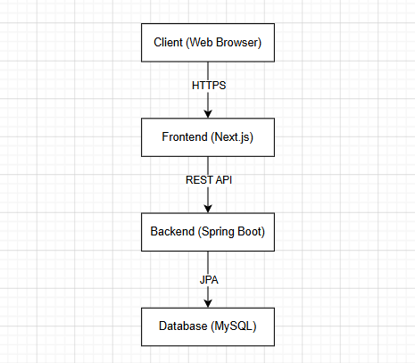

| 항목        | 내용                                  |
| ----------- | ------------------------------------- |
| 문서명      | System Architecture (시스템 아키텍처) |
| 버전        | v1.0                                  |
| 작성일      | 2026-07-16                            |
| 최종 수정일 | 2026-07-17                            |

# 시스템 아키텍처 (시스템 구조)

## 1. 문서 목적

본 문서는 예산 중심 가계부 시스템의 전체 구조를 정의하기 위해 작성하였다. 프론트엔드, 백엔드, 데이터베이스의 구성 요소와 상호작용 방식을 명확히 정의하여 시스템의 동작 구조를 이해할 수 있도록 한다. 또한 시스템 구현 과정에서 일관된 개발 방향을 유지하고, 각 구성 요소 간의 역할과 데이터 흐름을 명확하게 하기 위한 기준 문서로 활용한다.

## 2. 시스템 구성

### Client (Web Browser)

사용자는 웹 브라우저를 통해 시스템에 접속하여 예산 관리 기능을 이용한다. 모든 사용자 요청은 웹 브라우저를 통해 프론트엔드로 전달된다.

### Frontend (Next.js)

프론트엔드는 사용자 인터페이스(UI)를 제공하고 사용자의 입력을 처리한다. 또한 백엔드의 REST API와 통신하여 데이터를 조회하고 화면에 표시한다.

### Backend (Spring Boot)

백엔드는 사용자 요청에 대한 비즈니스 로직을 처리하고 REST API를 제공한다. 또한 데이터베이스와 연동하여 데이터를 저장하고 조회한다.

### Database (MySQL)

데이터베이스는 사용자 정보, 예산, 카테고리, 수입 및 지출 내역 등 시스템의 모든 데이터를 저장하고 관리한다.

## 3. 기술 스택 (Technology Stack)

| 구분            | 기술                              | 설명                                          |
| --------------- | --------------------------------- | --------------------------------------------- |
| Frontend        | Next.js                           | 사용자 인터페이스(UI) 및 클라이언트 화면 구현 |
| Backend         | Spring Boot                       | REST API 및 비즈니스 로직 구현                |
| Language        | Java, JavaScript                  | 백엔드 및 프론트엔드 개발 언어                |
| Database        | MySQL                             | 데이터 저장 및 관리                           |
| ORM             | Spring Data JPA                   | 데이터베이스 접근 및 객체 매핑                |
| Build Tool      | Gradle                            | 백엔드 프로젝트 빌드 및 의존성 관리           |
| Version Control | Git, GitHub                       | 소스 코드 버전 관리                           |
| IDE             | IntelliJ IDEA, Visual Studio Code | 개발 환경                                     |

## 4. 시스템 아키텍처 (System Architecture)



## 5. 프로젝트 구조 (Project Structure)

프로젝트는 프론트엔드, 백엔드, 문서를 분리하여 관리하며, 전체 디렉터리 구조는 다음과 같다.

```text
budget-tracker/
├── backend/
│   ├── src/
│   │   ├── main/
│   │   │   ├── java/
│   │   │   │   └── com/example/budgettracker/
│   │   │   │       ├── config/
│   │   │   │       ├── controller/
│   │   │   │       ├── dto/
│   │   │   │       ├── entity/
│   │   │   │       ├── repository/
│   │   │   │       └── service/
│   │   │   └── resources/
│   │   └── test/
│   ├── build.gradle
│   └── settings.gradle
│
├── frontend/
│   ├── app/
│   ├── components/
│   ├── lib/
│   ├── public/
│   ├── styles/
│   └── package.json
│
├── docs/
│   ├── images/
│   ├── 00-project-charter.md
│   ├── 01-project-overview.md
│   ├── 02-user-story.md
│   ├── 03-requirements-specification.md
│   ├── 04-use-case.md
│   ├── 05-system-architecture.md
│   ├── 06-database-design.md
│   ├── 07-api-design.md
│   ├── 08-ui-design.md
│   ├── 09-test-report.md
│   └── 10-retrospective.md
│
└── README.md
```